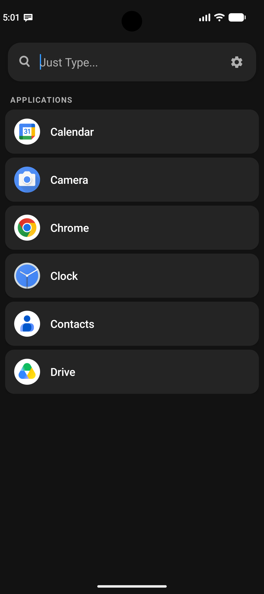
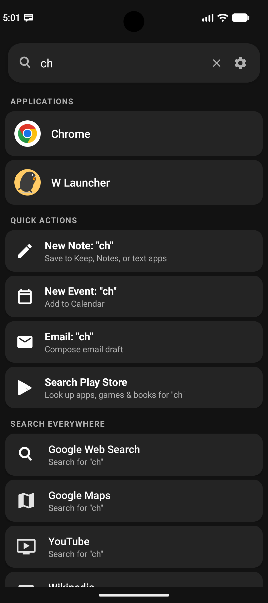
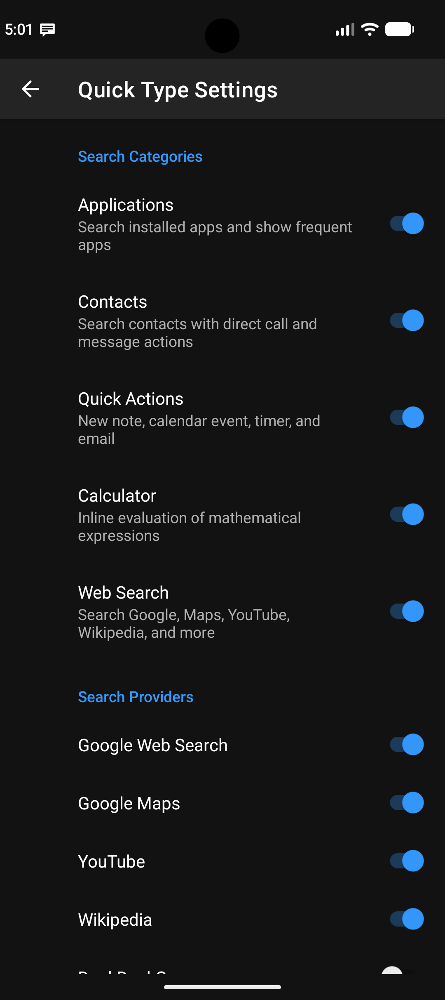

# Quick Type (Just Type...)

A fast, lightweight universal search and quick actions tool for Android inspired by the legendary **Just Type** feature from Palm / HP webOS.

This application was originally conceived to accompany [W Launcher](https://github.com/achunt2143/W-Launcher), but is fully independent and works on any Android device and launcher.

## Screenshots
<p align="center">
  
  
  
</p>

## Features

- **Universal Real-Time Search**: Start typing to simultaneously search across installed apps, contacts, quick actions, calculator, and web engines with zero prefix requirements.
- **Contextual Quick Actions**:
  - **New Note / Memo**: `ACTION_SEND` intent with your typed text prefilled for Keep, Notes, etc.
  - **New Calendar Event**: `ACTION_INSERT` with event title prefilled.
  - **Smart Timers & Alarms**: Detects natural language queries like `timer 15m` or `alarm 7:30am`.
  - **New Email**: Compose email drafts with subject prefilled.
  - **Search Play Store**: Immediate app and game lookup.
  - **Direct Phone Dial**: Dial numbers directly from the search bar or matched contact cards.
- **Inline Calculator**: Instant arithmetic evaluation (`+`, `-`, `*`, `/`, `%`, `^`, parentheses, and percentages) with tap-to-copy.
- **App Launch Tracking & Frequency**: Displays your most frequently used apps when the search box is empty.
- **Fuzzy & Acronym App Search**: Easily find apps by word fragments or initials (`"yt"` $\rightarrow$ **Y**ou**T**ube).
- **Direct Contact Actions**: Matched contacts display direct **Call** (📞) and **SMS** (💬) action buttons.
- **Digital Assistant Support**: Set Quick Type as your default digital assistant app (accessible via long-press home or corner swipe gestures).
- **Quick Settings Tile**: Launch Quick Type from anywhere via your notification shade.
- **Hardware Keyboard Support**: Automatic keystroke routing when using physical keyboards (e.g., Unihertz Titan, F(x)tec, or Bluetooth keyboards).
- **Customizable Search Providers**: Enable or disable Google, Maps, YouTube, Wikipedia, DuckDuckGo, Reddit, GitHub, and Amazon in Settings.

---

## Build Instructions

- Minimum SDK: Android 8.0 (API 26)
- Target SDK: Android 16 (API 36)
- Compile SDK: API 36
- Java Target: Java 17
- Build System: Gradle

To build with Gradle:
```bash
./gradlew assembleDebug
```

To run unit tests:
```bash
./gradlew testDebugUnitTest
```

---

## Release History

See [RELEASE_NOTES.md](RELEASE_NOTES.md) for full details on each version.

- **9/22/2026 — Version 1.0.0**: Major release! Complete webOS Just Type transformation — universal multi-category search, contextual quick actions (notes, calendar, timers, alarms, email), inline calculator, app launch frequency tracking, direct contact call/sms buttons, Android 15/16 window insets padding, digital assistant integration, Quick Settings tile, customizable search engines, and target SDK 36 upgrade.
- **Earlier Versions (0.9.0)**: Initial prototype with basic app launch, contact dialing/sms prefixes, and search widget.
